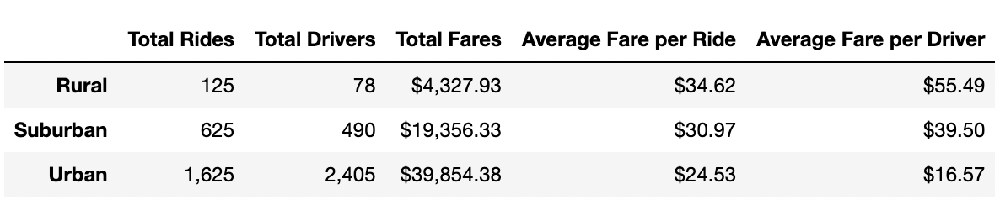

# PyBer_Analysis
## Overview of the analysis:

The purpose of this project was to complete an exploratory analysis and create visualizations of the 2019 ride sharing data from PyBer. Using the provided CSV files  located in the resources folder ride_date.csv and city_data.csv,  to help the company increase access to ride sharing services and determine affordability for underserved area. The two datasets were merged using left join based on the “city” column to create one DataFrame named pyber_data_df. The city types being compared are urban, suburban, and rural. 

---
## Resources:
Data Sources: ride_data.csv, city_data.csv

Software: Anaconda 4.13.0, Jupyter Notebook 6.4.11, Python 3.8.9

Libraries: Pandas 1.4.2, Matplotlib-inline 0.1.3, Matplotlib 3.5.2

---
## Results:

Using the merged dataset to create a summary DataFrame by city type, show that rural cities have fewer drivers and riders with higher average fares prices than urban cities. The total rides for rural cities is thirteen times less than in urban cities. The average fare per ride 1.4 times more in rural cities compared to urban cities. Urban cities total fares were two times higher than suburban cities and nine times higher than in rural cities. 

---

The Percentage of Total Rides by City Type: 

Urban cities made up more than 2/3 of the percentage of total rides in 2019. The suburban cities made up over 26% of the of total rides and rural cities had the smallest percentage with just over 5% of total rides in 2019.

---

The Percentage of Total Drivers by City Type: 

Drivers in the urban cities are in the majority with just over 80% of total drivers in the 2019 data. With suburban cities making up only 16.5% and rural cities 2.6%. 

---

The Percentage of Total Fares by City Type: 

This pie chart shows that over 60% of total fares by city type, were in urban cities. Suburban cities counted for 30.5% of total fares and rural cities 6.8% in 2019.

---

Average Fare per Ride and Driver by City Type:

The bubble chart “PyBer Ride-Sharing Data (2019)” shows the relationship between the total number of drivers and the average fare price. As the total number of rides per city increases, the average fare tends to decrease. This points to a negative relationship. The circle size correlates with the driver count per city. Rural cities have less drivers and rides per city than urban and suburban cities however rural city fare range from middle to high prices.

---

Total Fare by City Type:

The multiple-line chart “Total Fares by City Type” shows the total weekly fares for each city type from January to April 2019. The chart shows that total fares in urban cities is nine times higher than in rural cities and two times higher than suburban cities. 

---
## Summary:

The PyBer summary DataFrame indicates there is room for further analysis. Urban cities total fares were two times higher than suburban cities and nine times higher than in rural cities. Because of the general trend is higher number of drivers and rides correlates with low to medium fares, the fares in urban cities should increase if the number of drivers in urban cities is reduced. As well as increasing the number of drivers in rural cities to ensure there are the necessary drivers needed to meet the ride demand. To determine additional contributing factors (on all three city types), analysis such as geographic size, travel distance, and population vs the average number of drivers should be conducted.

---
